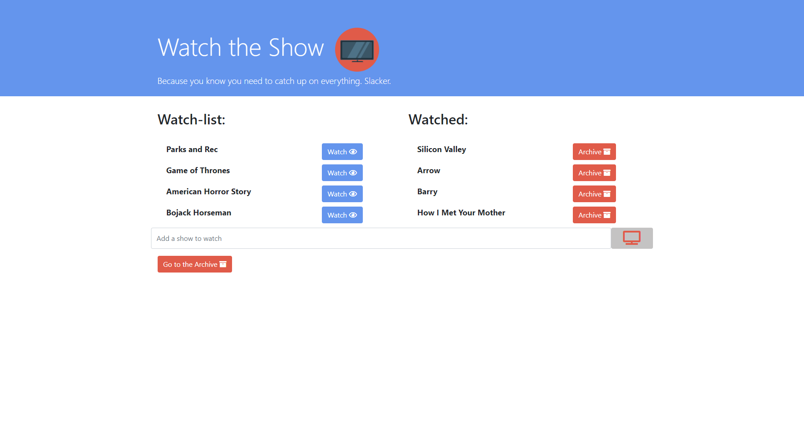
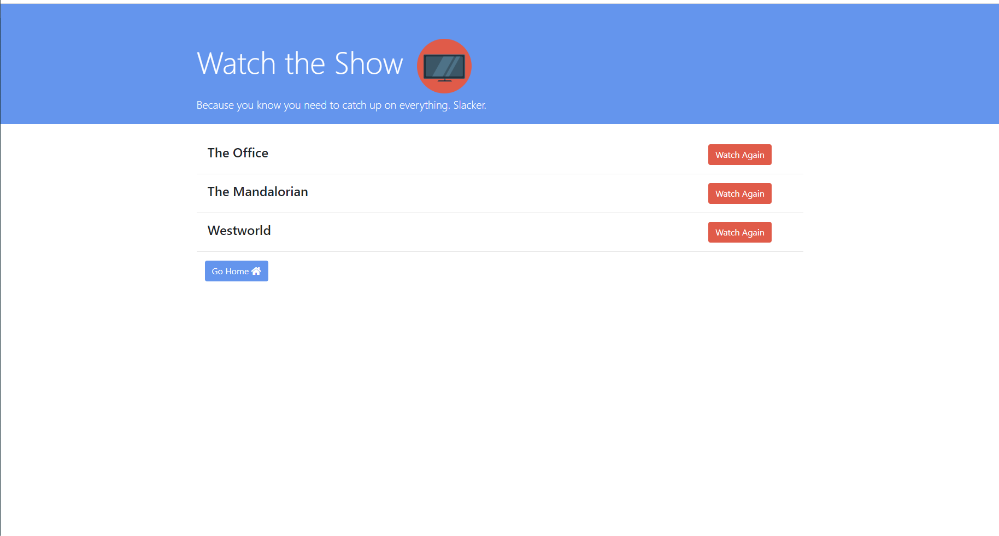
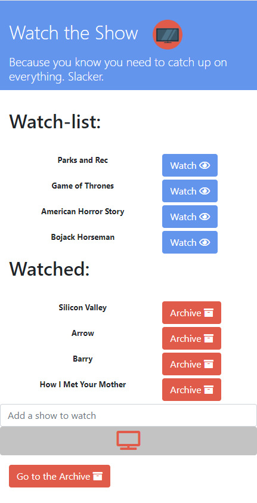
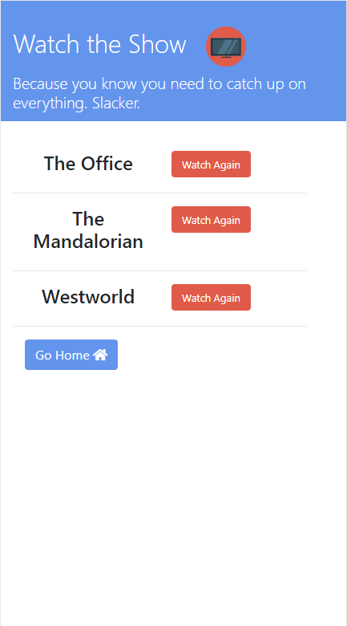

# watchTheShow

Watch the show is a simple app to track the shows you want to watch, track what youve seen, and remind yourself to watch some again. The application is fully responsive across mobile device sizes. Additionally, clicking the show title on either page will give a breif snippet and image from OMDB about the show (assuming the title is entered properly).

http://watchtheshow.herokuapp.com/

# Technologies:

Watch the show was made using html, css, bootstrap, javascript, jquery, mysql, node.js, express, handlebars, and a home-made ORM. It makes use of the MVC model and is easily scalable to add new fuinctionality.

# Future Plans:

I plan to add individual user accounts to track by user as well as add information about each show added and options for streaming the show. Additionally, validation for show name would be helpful.

# Images

